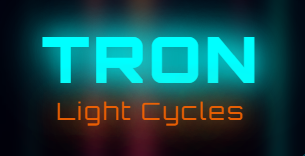

  
  
  # 🏍️ TRON Light Cycles
  
  
  
  
  
  
  **🚀 Navigate your light cycle through the digital grid and outmaneuver your opponents!**
  

---

## 📖 Overview

This project is a two-player game where each player controls a motorcycle and must navigate it to avoid colliding with the walls, the trail of the other player, or their own trail. The motorcycles speed up as the game progresses, making it increasingly challenging.

## 🎮 Gameplay

**🎯 Controls:**
- **Player 1:** Use the arrow keys (↑↓←→) to control the direction of your motorcycle
- **Player 2:** Use W/A/S/D keys to control your motorcycle  
- **Alternative:** Click and drag the mouse to change the motorcycle's direction

**⚡ Features:**
- Players can pause, restart, and switch control between mouse and keyboard inputs during the game
- You can choose who has command of the mouse by clicking the corresponding player button (player 1 or 2)
- When you have control, you can still use the keyboard keys to maneuver your motorcycle
- **🏆 Victory System:** First player to reach 7 points wins the game!

## Future Improvements

Here are some planned improvements and features that will be added to the game in future updates:

1. **Sound Effects Integration:**
   - Add sound effects for movements such as left and right turns.

2. **Enhanced Graphics and Visual Effects:**
   - Improve the appearance of the motorcycle trail.
   - Custom light cycle skins: Personalized bikes and trails

3. **Customizable Game Settings:**
   - Provide options for customizing game settings such as game speed/difficulty levels and  grid size.

4. **Mobile Compatibility:**
   - Optimize the game for mobile devices and ensure responsive design for various screen sizes.
   - Offline gameplay with Service Workers

5. **Multiplayer Mode:**
- 2 to 8 simultaneous players in multiplayer battles
- Last cycle standing wins
- Real-time online multiplayer with WebSockets
- Node.js backend for matchmaking and room management
- Private rooms: Create and join custom games
- Spectator mode for eliminated players

6. **Power-ups & special abilities**
- Speed Boost: Temporary acceleration for quick escapes
- Shield: Protection against one collision
- Teleport: Instant transportation to avoid obstacles
- Wall Break: Ability to pass through walls once
- Dynamic arenas: Moving obstacles and disappearing zones

## Credits
This game was created by Katia Kaci as a fun project to demonstrate programming and game development skills.

Enjoy playing! 😃